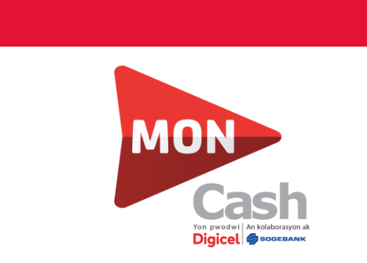
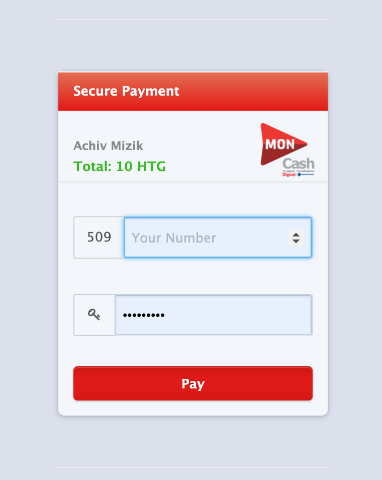

# Moncash_ruby



This is a simple Ruby wrapper for MonCash API. This Gem Allow you to implement the MonCash payment processing on your Ruby or Ruby on rails project. This gem is the simplest way you can use the MonCash API for now. 

``Be careful, this Gem is not Developed by the Official developer of MonCash``. Certil Remy Build this gem for his own project and decided to share it with the Ruby developers. If you want to report Issues about this gem you should do it here by opening a new issue,  not on MonCash website. We will be glad to assist you if you're not a developer but not free :slightly_smiling_face: .


## Feature Available
- Create token
- Create payment
- Get transaction detail


## Install the gem on your project
Add this to your GemFile

```
gem 'moncash_ruby' 
```

then run 

```
bundle install
```

## Making your first payment
What you really need to make your first payment?

[Click here to go to the moncash website](https://sandbox.moncashbutton.digicelgroup.com/Moncash-business/Login)   
Create your free business account. If you get stuck please take a look at this doc https://sandbox.moncashbutton.digicelgroup.com/Moncash-business/resources/doc/MC-Business.pdf . Don't forget to create a test account.

Now you get your ``'client_id'``  and your ``'secret_id'``. Please the document below should help you on how to generate them do not ignore it, They are very important for our next step. You don't need to care about token expiration, Generate token, API endpoint, and token serialization. We handle them for you. Just complete the form and grab your ``'client_id'`` and ``'secret_id'``.
To make your first payment.

### Ruby on rails

```
require 'moncash_ruby'
moncash = Moncash::Hit.new(your_client_id, your_secret_id)
url = moncash.create_payment(amount, oder_id)
redirect_to url

```

Yep that's it
Let me explain. In the first line we require ``moncash_ruby``(the gem). In the second line I initialize moncash Module which require your ``client_id ``and your ``secret_id``. you must pass these argument as a string like

```
moncash = Moncash::Hit.new('12gs45', 'dggywywgdg')

```

And finally, in the third line you just create a new payment, you hit the MonCash API to create the payment.
The ``create_payment`` method requires two arguments, they are all ``integer`` the amount of money and the order Id. The last part is the ``redirect_to url ``. The create payment method generate a url for you, this is the gateway where your users will enter their information like their phone number and their moncash pin to pay you.



When your payment completed you'll be redirected to your main url, the one you provided for your website to the dashboard of moncash. This url will follow with your transaction id. to confirm if the payment have been completed or failed you need the transaction id from the url. Get the transation id from the prarams. The URL may look something  like this https://youdomain.com/transactionId=1234324. Now you have the transaction id we can confirm whether the transaction success or failed.

## Get payment details 
Earlier we told you you need the transaction id to check if the payment is succeeded or not. We Create a method for you, this method will get the transaction with the id and return a hash with all information about the payment.

```
payment = moncash.get_payment_detail(transaction_id)
```

## More about Create payment and the get_payment_detail method

Earlier I told you this method requires two arguments, yes but there's another one his value is 'sandbox' by default. In this demo, you just hit the MonCash ``sandbox``. When your project is live you must pass the ``'live'`` argument in the create method and the `` get_payment_detail``.

```
require 'moncash_ruby'
moncash = Moncash::Hit.new(your_client_id, your_secret_id)
url = moncah.create_payment(amount, oder_id, 'live')
redirect_to url

```
Check payment detail in live mode 

```
payment = moncash.get_payment_detail(transaction_id, 'live')
```

The ``sandbox`` is for testing Moncash in your project for development purpose only, remember when your project is live use the live argument. 

## Contribution
If you want to contribute to this project you're welcome fork this project and clone it.
Then run 

```
 bundle 
```
To start working you need to create a new branch from the dev branch. when your feature is available open your pull request compared to the dev branch again. 

We have GitHub action already installed, If your test pass we will merge your pull request. If it isn't please fix them and submit it again.

## Authors

Certil Remy Twitter @certilremy, Email: help@certilremy.com

